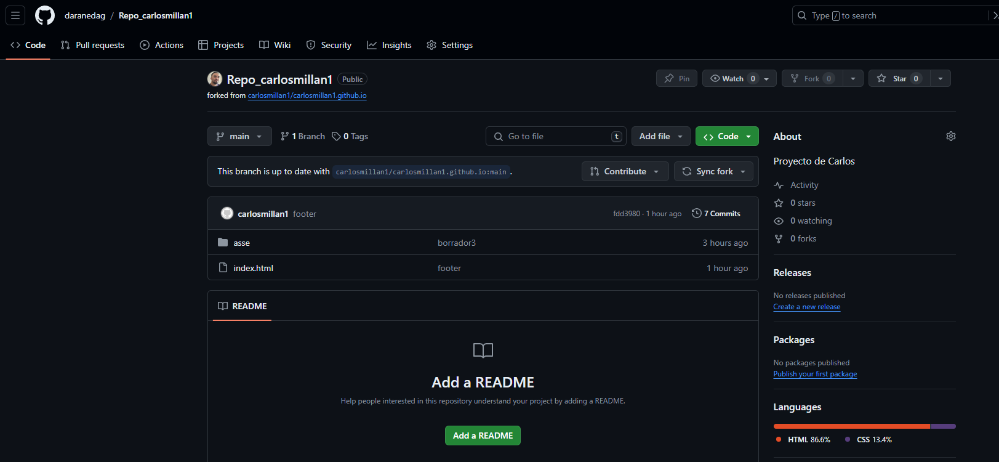
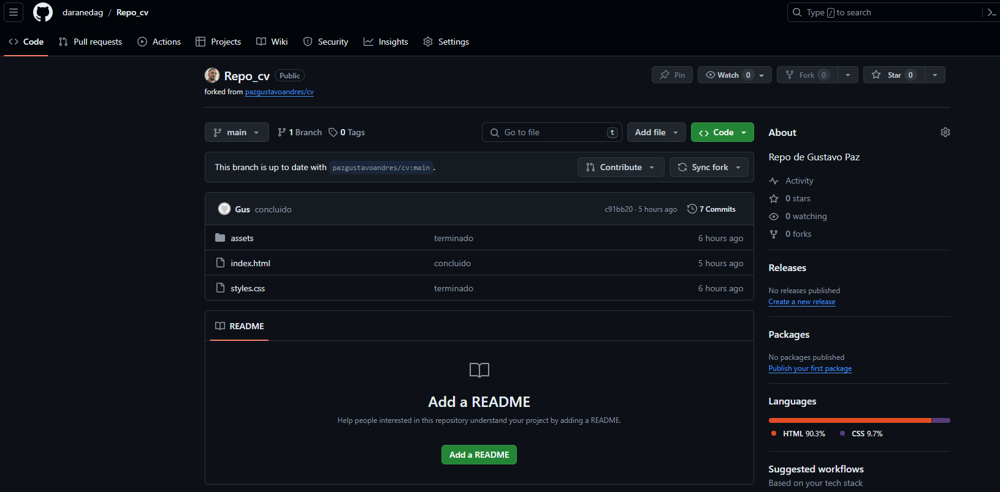
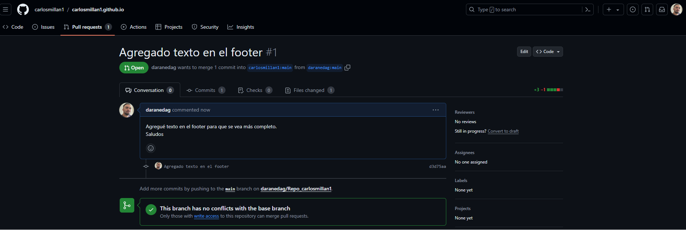
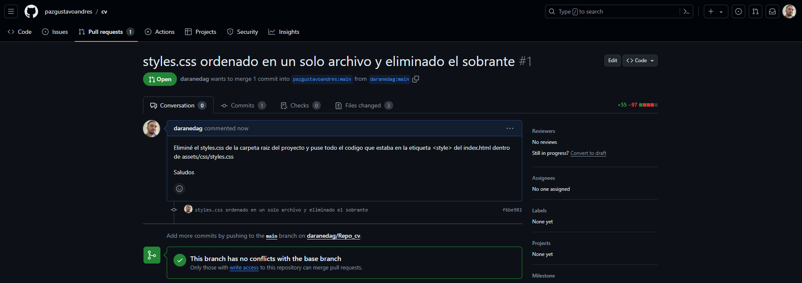

# PruebaADL_Modulo1
**IMPORTANTE**

Los forks realizados para el punto 4 son los siguientes:

1.- Fork 1: [carlosmillan1](https://github.com/carlosmillan1)

2.- Fork 2: [pazgustavoandres](https://github.com/pazgustavoandres)

Los commits realizados para el punto 5 fueron enviados como PR a los respectivos dueños
1.- PR 1: 

2.- PR 2:

Colaboradores agregados:
* [Gustavo Paz](https://github.com/pazgustavoandres)
* [Carlos Millan](https://github.com/carlosmillan1)